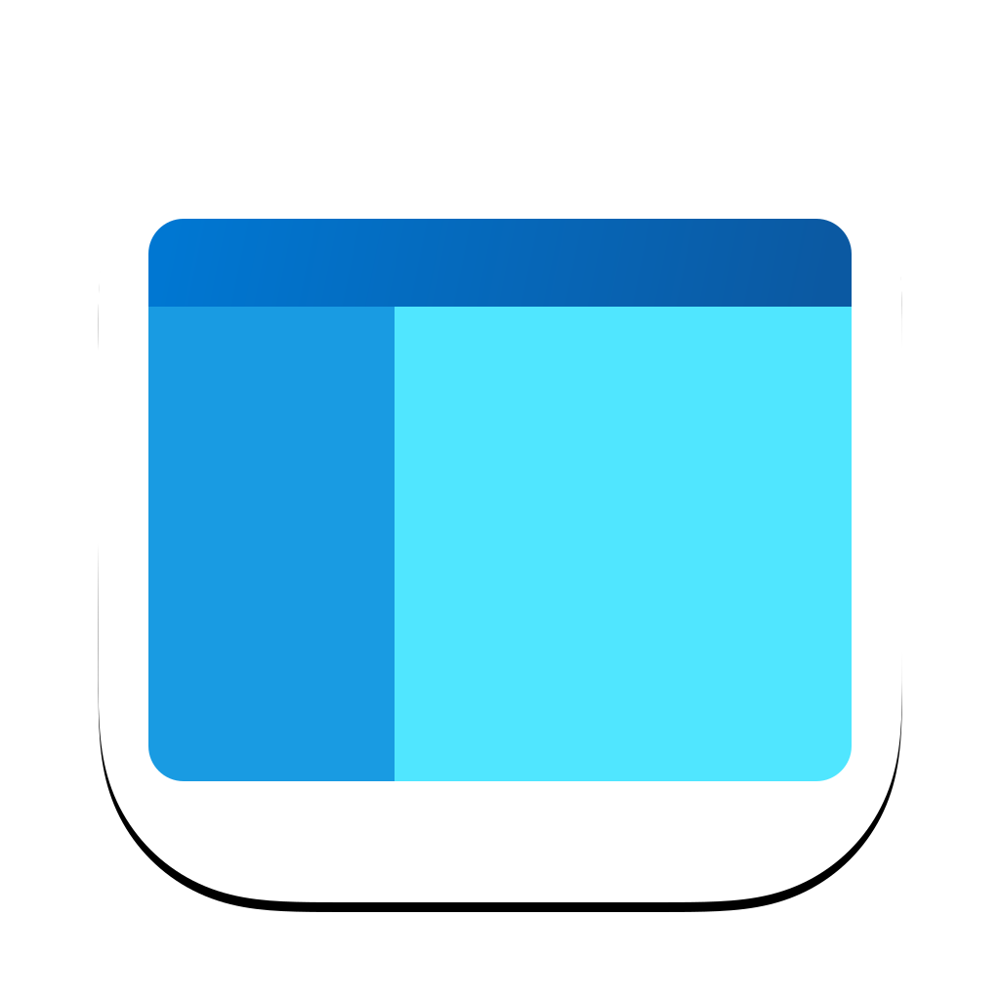
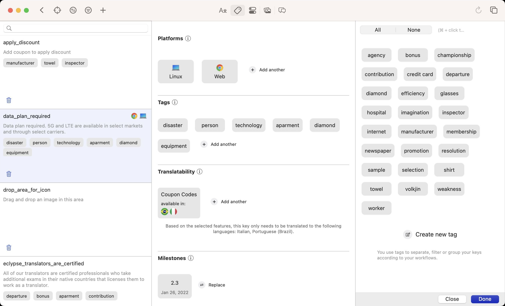
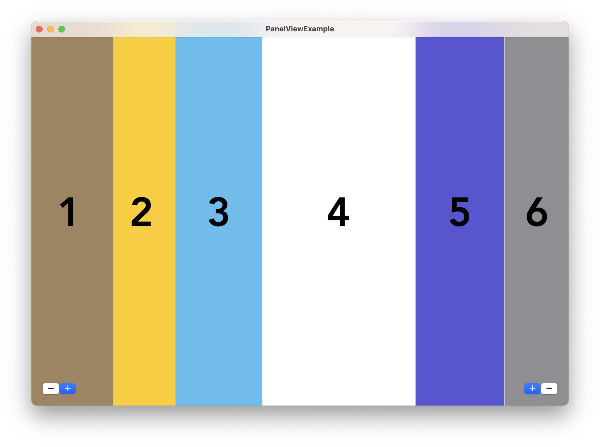
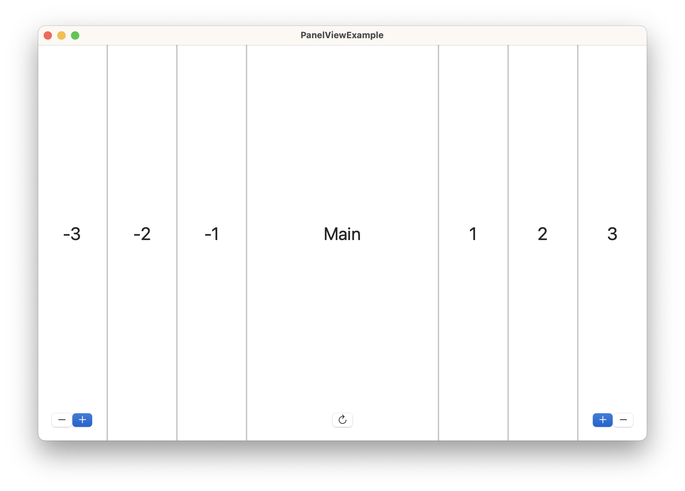
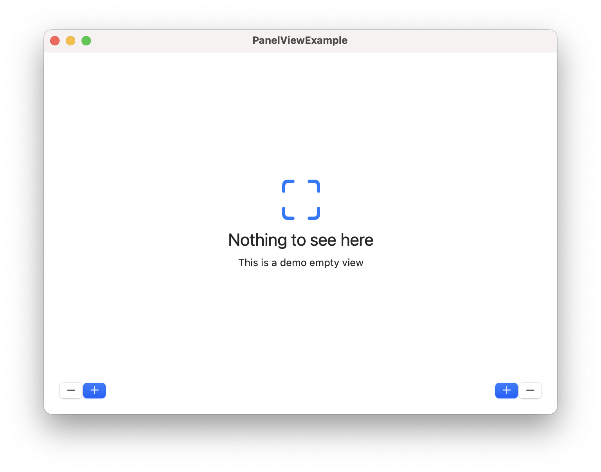

<p align="center">
  
</p>

<p align="center">
    
    
	
	
</p>

# PanelView
A superpowered SplitView that gives controls back to the developer.

<p align="center">
  
	<br/>
	Made with PanelView
</p>
<br/>

## Installation (iOS, macCatalyst)
### Swift Package Manager

Add PanelView to your project via Swift Package Manager.

`https://github.com/eclypse-tms/PanelView`

### Manually

Drop the [source files](https://github.com/eclypse-tms/PanelView/Sources) into your project.
<br/>

## Why PanelView?
1. Apple's UISplitViewController works and behaves in unexpected ways. Developer has to come up with too many work-arounds to get UISplitViewController to work as desired. PanelView gives control back to the developers.
1. UISplitViewController only lets you run in 2 or 3 column mode. PanelView has no limitations on how many columns you can have.
1. You can place the columns (panels) to left or to the right of your main view in any combination.
1. You can stack views top-to-bottom instead of side-by-side. This is in fact why we call our library PanelView.
1. You can embed a PanelView in another PanelView to have complex, mosaique like layouts.
1. In compact screen size environments instead of collapsing down to one column like UISplitViewController forces you, you can stack your panels on top of each other instead.
1. You have fine grain controls on how and when to display panels.
<br/>

<p align="center">
  
	<br/>
	PanelView that is split 6 way
</p>

## Basic Usage
```
import PanelView

let panelView = PanelView()
var config = PanelViewConfiguration()
config.interPanelSpacing = 2
panelView.configuration = panelView
// then add this PanelView to your view hierarchy in anyway you see fit

// let's say you have 3 panels you want to display
// from left to right: navigation, main screen and inspector panel 
// set the size constraints for the navigation panel
panelView.minimumWidth(320, for: .navigation)
panelView.maximumWidth(768, for: .navigation)
panelView.preferredWidthFraction(0.3, for: .navigation)

// set the size constraints for the inspector panel
panelView.minimumWidth(200, for: .inspector)
panelView.maximumWidth(575, for: .inspector)
panelView.preferredWidthFraction(0.25, for: .inspector)

let vc1 = ViewController1() 
let vc2 = ViewController2()
let vc3 = ViewController3()

panelView.show(vc1, for: .navigation)
panelView.show(vc2, for: .center)
panelView.show(vc3, for: .inspector)

```

# Full API

## Adding PanelView to a View Hiearchy
#### Option 1: Make PanelView the root view
```
// in your SceneDelegate File
import PanelView
...
func scene(_ scene: UIScene, 
           willConnectTo session: UISceneSession, 
           options connectionOptions: UIScene.ConnectionOptions) {
  guard let windowScene = (scene as? UIWindowScene) else { return }
  ...

  // instantiate PanelView
  let panelView = PanelView()
  // now configure the PanelView according to your needs
  ...

  window = UIWindow(windowScene: windowScene)
  window?.rootViewController = panelView
  window?.makeKeyAndVisible()
}

```

#### Option 2: Make PanelView a child of another ViewController
```
//in any ViewController
import PanelView

override func viewDidLoad() {
  super.viewDidLoad()
  ...
  
  // instantiate PanelView
  let panelView = PanelView()

  // now configure the PanelView according to your needs
  ...

  // make the PanelView child of this ViewController
  // and take up the entire available space
  addFullScreen(childViewController: panelView)
}
```

## Working with Panels
As opposed to UISplitViewController, PanelView lets you split your view horizontally or vertically. This is why we call it the `PanelView`. Consider the basic case where the panels are laid out side-by-side as in the SplitViewController. Each panel is referenced by its index. Index zero refers to the main/central view. Panels with negative indices refer to the views on the left side while panels with positive indices refer to the right side of the main screen.

<p align="center">
  
	<br/>
	Panels are positioned by their index
</p>
<br/>

When you are presenting only one viewcontroller you present it as the primary panel as follows:

```
let vcCentral = CentralViewController()
panelView.show(viewController: vcCentral, at: 0)
```

You can also refer to panels by their names: **the names you assign to them.**
```
// define a custom panel to refer to it by its name
extension Panel {
  // this panel is the primary view
  public static var main: Panel {
    return Panel(index: 0, tag: "main")
  }

  // this panel appears to the left of the center view
  public static var fileExplorer: Panel {
    return Panel(index: -1, tag: "fileExplorer")
  }
}

// then use their name instead of their index
let vcCentral = CentralViewController()
panelView.show(viewController: vcCentral, for: .main)

let feVC = FileExplorerViewController()
panelView.show(viewController: feVC, for: .fileExplorer)
```

## Configuring panel size
When panels are placed side-by-side, you can set the panel sizes by creating a minimum, maximum and a preferred size. 

```
panelView.minimumWidth(300, for: .fileExplorer)
panelView.maximumWidth(825, for: .fileExplorer)
panelView.preferredWidthFraction(0.33, for: .fileExplorer)
```

When the views are placed top-to-bottom, you use similarly named functions.
```
panelView.minimumHeight(300, for: .fileExplorer)
panelView.maximumHeight(825, for: .fileExplorer)
panelView.preferredHeightFraction(0.33, for: .fileExplorer)
```

Panel sizes can be adjusted programmatically or in the UI by dragging dividers in between the panels. You can turn this setting off.
```
// initiates a configuration object with default settings
var config = PanelViewConfiguration()
config.allowsUIPanelSizeAdjustment = false

let panelView = PanelView()
panelView.configuration = config

```

*Note: Central panel cannot be sized and always takes up the available space after other panels are laid out.*

## Orientation
Panels can be laid out horizontally or vertically. By default panels are laid out side-by-side like UISplitViewController. If you want to change this behavior, set the orientation to vertical in `PanelViewConfiguration`.


## Hiding a Panel
You can hide a panel 3 different ways: 
1. By its index
1. By its name
1. By the view controller that it contains
```
// hide the panel by its given name
panelView.hide(panel: .fileExplorer)
```

You may force the PanelView to release the view controllers upon hiding if you don't need 
to use them again.
```
// hide the panel by its given name
panelView.hide(panel: .fileExplorer, releaseViewController: .true)
```

If releasing the view controllers when panels are hidden is a common pattern in your application, you may prefer to set it to auto-release.

```
var config = PanelViewConfiguration()
config.autoReleaseViewControllers = true

let panelView = PanelView()
panelView.configuration = config

...
// hide the panel as usual 
// but you don't have to specify releaseViewController argument
panelView.hide(panel: .fileExplorer)
```

#### Panel Visibility

`func isVisible(panel:)` -> allows you to check whether any panel is visible or not. 

`var visiblePanels` ->  returns all currently visible panels sorted in ascending fashion.

`func presents(viewController:)` -> checks whether the provided viewController is currently being presented in one of the panels	

## Reacting to Screen Size Changes
Become the delegate to recieve screen size change events.
```
  let panelView = PanelView()
  panelView.delegate = self
  ...
  
  extension ViewController: PanelViewDelegate {
    func didChangeSize(panelView: PanelView, changes: ScreenSizeChanges) {
      if changes.contains(.horizontalSizeChangedFromRegularToCompact) {
          // screen size changed to compact
          // adjust panels if necessary
      }
   }

```

`func combineAll()` -> gathers all views in the center panel - maybe useful when the screen size changes to compact.

## Pushing and Popping ViewControllers on a Panel
All panels are embedded in a UINavigationViewController. This means you can push or pop view controllers just like you normally do.

`func push(viewController:on:)` -> adds another view controller to the navigation stack on the panel

`func popViewController(on:)` -> pops the top view controller from the given panel

`func replaceTopViewController(with:animated:on:)` -> replaces the top view controller on the specified panel with another view controller

`func popToViewController<T>(usingType:animated:on:)` -> pops the stack on the specified panel to the provided UIViewController type 

`var viewControllers: [Panel: UINavigationController]` -> access the children navigation controllers the PanelView manages

## Combine Support

If you are using Combine, PanelView publishes events on `panelSizeChanged` and `attachedToWindow` streams.
```
  let panelView = PanelView()

  panelView.panelSizeChanged
    .sink { sizeChanged in
    // screen size changed to compact or regular
    // adjust panels if necessary
  }.store(in: &cancellables)


  panelView.attachedToWindow
    .sink { _ in
    // PanelView is visible on the window
  }.store(in: &cancellables)

```

## Empty State
When there are no panels presented on the PanelView, it is possible to show a separate empty state. Provide a valid view in `PanelViewConfiguration.emptyStateView` to enable this functionality.

<p align="center">
  
	<br/>
	Example Empty View
</p>

## Panel Dividers
Each panel is visually separated by panel dividers. Dividers also allow panels to be adjusted in size. 

`PanelViewConfiguration.panelDividerColor` -> controls the divider color

`PanelViewConfiguration.panelDividerHoverColor ` -> controls the hover color

`PanelViewConfiguration.interPanelSpacing` -> the width or height of the panel dividers

`PanelViewConfiguration.allowsUIPanelSizeAdjustment` -> controls whether users can adjust the size of panels within the previously provided minimum and maximum parameters.


`func enableResizing(for:)` -> enables a panel to be resized in the UI.

`func disableResizing(for:)` -> removes the ability for a panel to be resized in the UI. Panels can be resized programmatically.

## SwiftUI Support
Full SwiftUI support will be added in an upcoming release. 

## Example
This repository contains an [Example app](../PanelViewExample) where you can demo the PanelView.

## Reference
use the following PanelViewConfiguration object and pass it to PanelView.
```
/// Provides configuration possibilities for PanelView
public struct PanelViewConfiguration {
  /// runs the PanelView in horizontal or vertical mode.
  ///
  /// Once the orientation is determined, it cannot be changed later on.
  public var orientation: PanelOrientation
  
  /// the view to display when there are no panels visible.
  public var emptyStateView: UIView?
    
  /// when this value is not nil, the view dividers will be highlighted when
  /// a pointer hovers over them. when this value is nil, no highlighting will
  /// occur.
  ///
  /// only applicable to macCatalyst
  public var panelDividerHoverColor: UIColor?
  
  /// the this color is only visible in between the panels - when there are
  /// multiple panels open.
  public var panelDividerColor: UIColor
  
  /// The space in the between the panels.
  public var interPanelSpacing: CGFloat
  
  /// Number of panels on each side that are created and added to the view hiearchy.
  /// The default value is 4. This means 4 panels on each side of the main panel
  /// for a total of 9 panels are added to the view hierarchy. Priming panels
  /// before hand helps with animations and transitions to work correctly. If you know
  /// that you will need more than 9 panels adjust this number accordingly otherwise
  /// leave it as-is.
  public var numberOfPanelsToPrime: Int
  
  /// the animation duration when inserting and removing panels from the view
  public var panelTransitionDuration: Double
  
  /// determines whether the panels heights or widths can be changed in the UI
  public var allowsUIPanelSizeAdjustment: Bool

  /// controls whether to automatically release the view controllers when a panel is hidden
  ///
  /// This property is by default false. This means that view controller will be kept
  /// in memory when its associated panel is hidden from view. This allows you to
  /// re-use the view controller when the panel is shown again without having to 
  /// worry about preserving its state.
  /// On the other hand if you are not planning on re-using the same view controller
  /// when the panels are hidden, set this property to true to automatically 
  /// reclaim the memory occupied by the view controller.
  public var autoReleaseViewControllers: Bool
}
```
